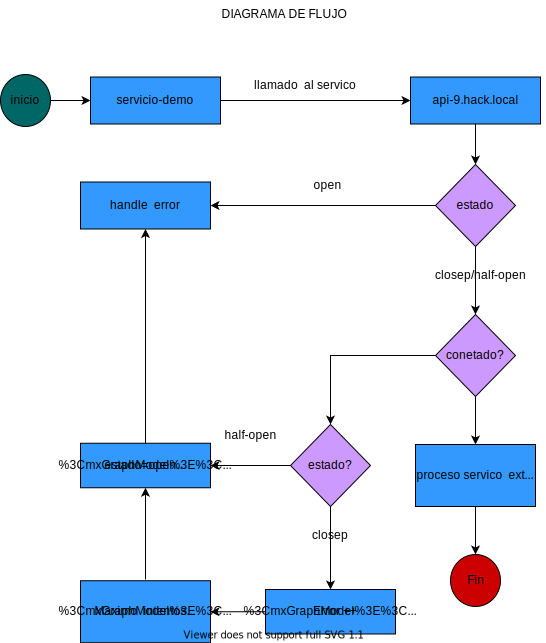

# Propuesta de solución para Hackathon Ceiba 2021

## Descripción de la solución
Observando el comportamiento del servicio que vamos  consumir  se implementa   una solución  basada en  el patrón Circuit Breaker. 
Este  nos brinda   la facilidad de   manejar las  fallas  ocasionadas  por la  falta de disponibilidad en la  comunicación entre servicios   esto  lo hace simulando  un interruptor  eléctrico, el  flujo  parte de tres  estados:

<b>Closed:</b> El circuito está cerrado y el flujo fluye ininterrumpidamente estado inicial.

<b>Open:</b> El circuito está abierto y el flujo interrumpido devolviendo la ultima excepción.

</b>Half-Open:</b> El circuito está medio abierto (o medio cerrado) dando una oportunidad al flujo para su restauración

## Drivers que orientan la toma de decisiones para la solución propuesta
<b>  </b>
## Diagrama de solución

| Elemento | Descripción |
| :----    | :---        | 
| DB | Guardar datos |    
